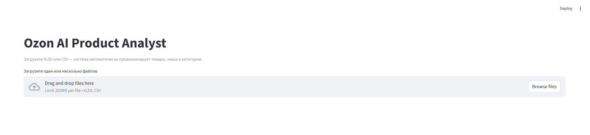
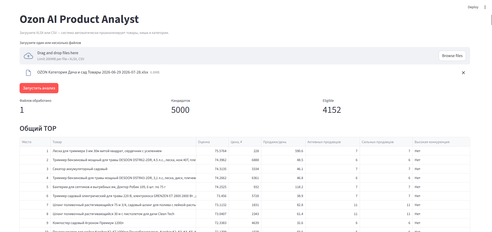
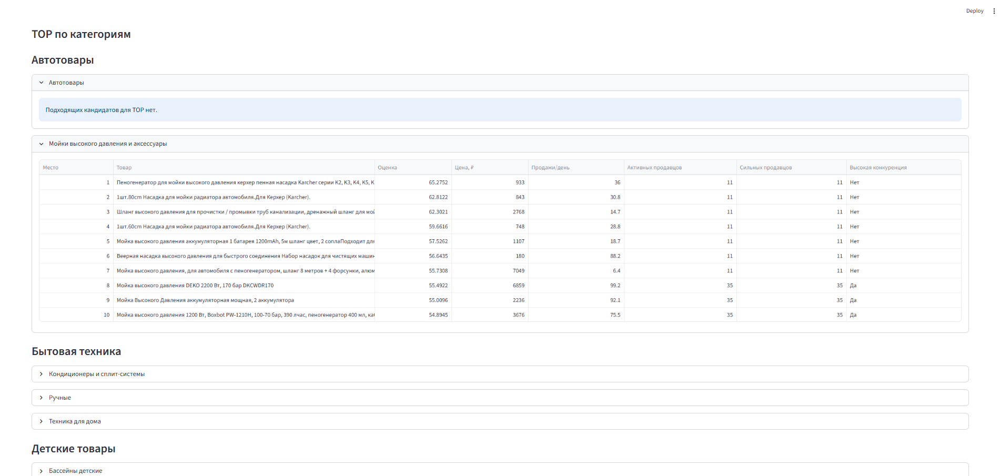
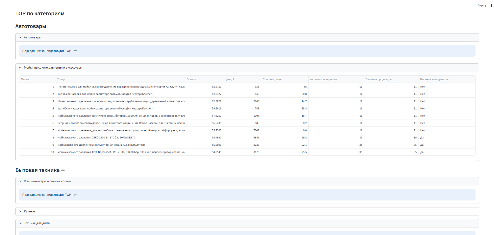

# Ozon AI Product Analyst

An AI-assisted marketplace product research system built with Python, Pandas, OpenAI, and Streamlit.

The application analyzes marketplace XLSX/CSV exports, automatically classifies products into meaningful competitive niches, calculates deterministic business metrics, and ranks promising product opportunities. It is designed as a portfolio MVP that demonstrates a hybrid AI + deterministic analytics architecture.

## Key Features

- XLSX and CSV marketplace data ingestion
- Semantic source-column mapping for changing file schemas
- Data validation, normalization, and cleaning
- Automatic category classification with OpenAI Structured Outputs
- Cache-first reuse of previously learned category rules
- Functional-family classification inside broad marketplace categories
- Product-role enrichment where applicable
- Niche-level competition analytics
- Active seller and strong seller analysis
- Market depth and concentration metrics
- Deterministic eligibility and opportunity scoring
- Global product TOP ranking
- TOP ranking by root category and marketplace subcategory
- High-competition warnings
- No forced winners in weak or low-depth markets
- Streamlit web interface
- Graceful continuation when an individual category AI request times out
- Automated pytest test suite

## Demo

### 1. Upload Marketplace Data

Upload one or more XLSX/CSV files through the Streamlit interface.



### 2. Global Product Ranking

The system processes the uploaded dataset, calculates business metrics, filters unsuitable candidates, and builds a global opportunity ranking.



### 3. Category-Level Opportunities

The same analysis is broken down by root category and marketplace subcategory so users can inspect the strongest candidates inside each market segment.



### 4. No Forced Winners

If a subcategory does not contain an eligible opportunity, the application explicitly reports that no suitable TOP candidate exists instead of ranking the least-bad option.



## Architecture

The application is split into several analytical layers.

### 1. Streamlit Interface

- Uploads XLSX/CSV marketplace files
- Starts the analysis pipeline
- Displays processed-file and candidate counts
- Shows the global TOP
- Shows TOP candidates by category and subcategory
- Hides internal technical fields from the end user

### 2. Data Ingestion and Semantic Mapping

- Loads XLSX and CSV files
- Detects and maps source columns
- Supports changing marketplace export schemas
- Validates required analytical inputs before downstream processing

### 3. Normalization and Product Attributes

- Cleans and normalizes raw marketplace data
- Creates stable product attributes
- Normalizes category values
- Prepares data for deterministic grouping and scoring

### 4. AI Category Classification

Unknown categories are analyzed from real product examples.

```text
known category
-> cached rules
-> deterministic Python classification

unknown category
-> product examples
-> OpenAI Structured Output
-> functional-family rules
-> Python quality checks
-> runtime cache
-> deterministic Python classification thereafter
```

AI is used for semantic interpretation. It does not calculate the final business score.

### 5. Runtime Classification Cache

Learned category classifications are stored in:

```text
data/cache/category_classifications.json
```

When the same category appears in a later file, the system reuses the cached rules instead of repeating the same AI classification work.

Cached rules can also be enriched when a genuinely missing functional family is detected. New rules are accepted only when deterministic quality gates confirm that classification quality does not regress.

### 6. Competition Analytics

The system calculates competition at the niche level rather than treating every broad marketplace category as one market.

It evaluates:

- active sellers
- strong sellers
- market depth
- market concentration
- top-seller shares
- high-competition warnings
- niche-level demand and opportunity metrics.

SKU count is not treated as seller count.

### 7. Deterministic Scoring and Ranking

Python is responsible for business calculations.

```text
Python calculates.
AI interprets.
```

The pipeline applies deterministic eligibility rules and opportunity scoring before ranking products.

A TOP candidate means:

> a promising marketplace opportunity worth deeper investigation.

It is not a guaranteed recommendation to launch or purchase a product.

## Input Data

The application accepts:

- `.xlsx`
- `.csv`
- multiple files in one analysis run

The project is not tied to one hard-coded marketplace export schema. Source columns are mapped semantically before validation and normalization.

The analytical pipeline expects enough source data to derive product identity, categories, pricing, sales, revenue, and competition-related metrics. Invalid or insufficient inputs are rejected or excluded from the relevant analytical stage rather than silently fabricated.

## How to Run

### 1. Clone the repository

```powershell
git clone https://github.com/ramilnramis-prog/ozon-ai-product-analyst.git

cd ozon-ai-product-analyst
```

### 2. Create and activate a vitual environment

Windows PowerShell:

```powershell
python -m venv .venv

.\.venv\Scripts\Activate.ps1
```

### 3. Install dependencies

Application dependencies:

```powershell
python -m pip install -r requirements.txt
```

Development and testing dependencies:

```powershell
python -m pip install -r requirements-dev.txt
```

### 4. Configure environment variables

Create `.env` from `.env.example` and fill in the required local values.

The `.env` file is excluded from Git and should never be committed.

### 5. Start the Streamlit application

```powershell
python -m streamlit run streamlit_app.py
```

Streamlit will print the local application URL in the terminal.

### 6. Upload marketplace data

Open the application in the browser, upload an XLSX/CSV file, and click **Запустить анализ**.

The current portfolio UI limits first-time AI classification to a small number of previously unseen categories per run to control API latency and cost. Cached categories are still processed automatically through Python.

### 7. Run automated tests

```powershell
python -m pytest -q
```

## Testing

The project includes automated tests for ingestion, normalization, category classification, cached enrichment, niche grouping, competition analytics, scoring, ranking, reporting, and multi-period orchestration.

Current verified test suite:

```text
129 passed
```

Run the full suite with:

```powershell
python -m pytest -q
```

## Core Modules

```text
app/data_loader.py
app/column_mapping.py
app/normalizer.py
app/data_cleaner.py
app/product_attributes.py
app/category_classifier.py
app/category_classification_ai.py
app/niche_grouping.py
app/competition.py
app/candidate_features.py
app/scoring.py
app/ranking.py
app/reporting.py
app/multi_period.py
streamlit_app.py
```

## MVP Scope

This repository is a portfolio MVP rather than a production SaaS.

Current scope intentionally excludes:

- user authentication
- billing
- multi-user concurrency
- production deployment infrastructure
- external database-backed cache storage

The focus of the project is the analytical architecture: combining semantic AI classification with deterministic, testable marketplace analytics.
